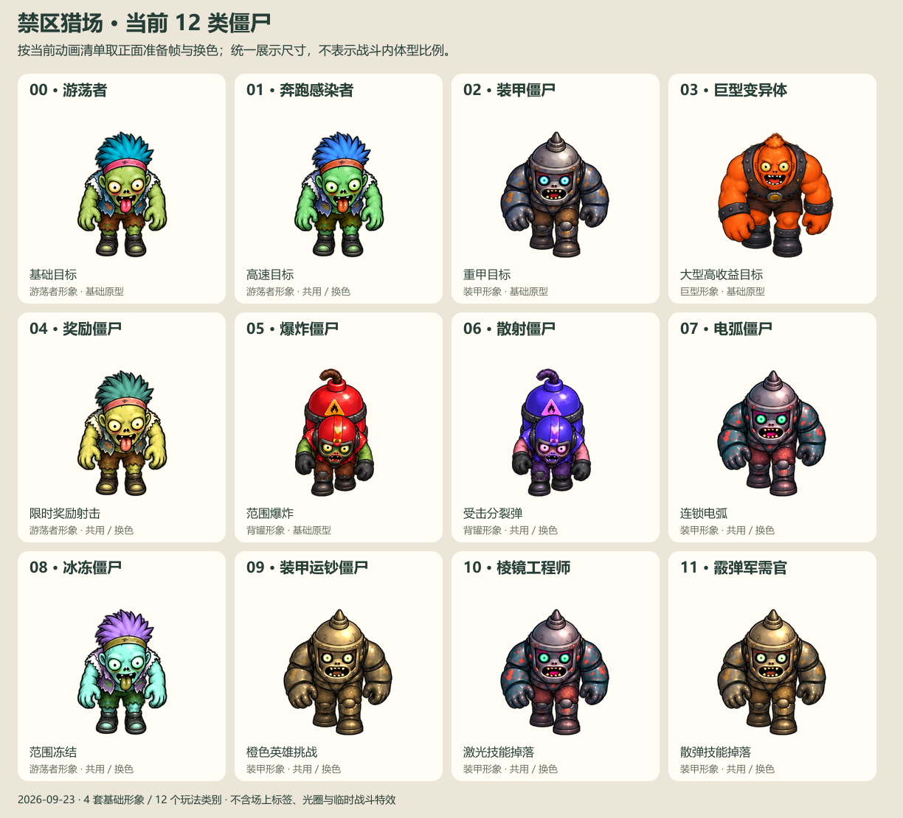
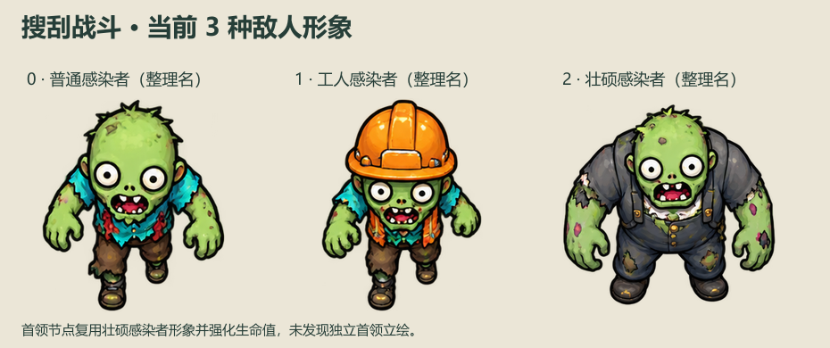
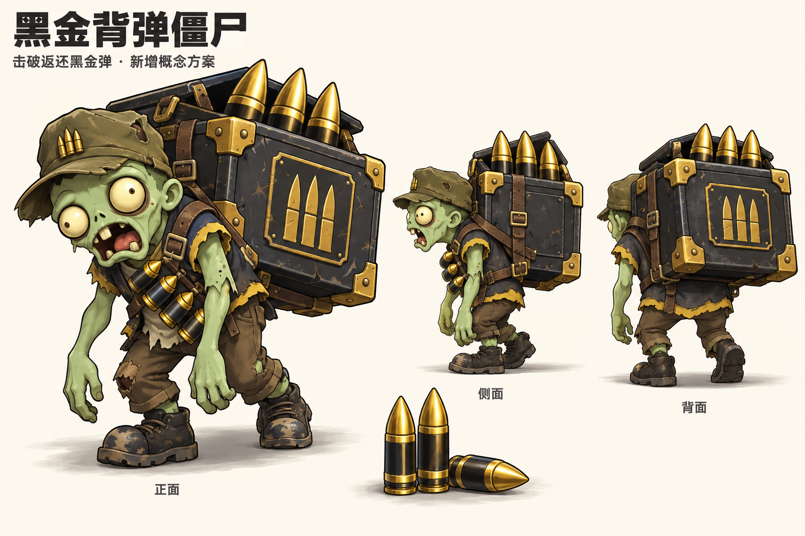

# 僵尸类别与形象总表

核对日期：2026-09-23。依据当前工作区代码、实际资源入口及动画映射整理。

现有内容共 **猎场 13 类 + 搜刮战斗 3 种敌人**。两套玩法的 kind 编号互相独立，不能混用。新增的 **黑金背弹僵尸**已完成 50 帧正式资源并接入游戏，详见[资源与接入记录](黑金背弹僵尸接入-20260923.md)。下文保留初始概念与规则设计，最终实现和验证以接入记录为准。

## 1. 禁区猎场：现有 12 类 + 新增 1 类

第十三类正式形象：

图中按当前动画清单取正面准备帧并应用对应换色。为便于辨认统一展示尺寸，不代表战斗内体型比例；场上标签、光圈和临时特效不在静态图中。

| kind | 类别 | 当前实际形象 | 功能与收益 | 状态 |
|---|---|---|---|---|
| 0 | 游荡者 | 绿皮、大眼、青色莫西干、粉色头带、破蓝背心、棕短裤、黑靴 | 基础目标，普通命中后 40% 概率击杀；基础收益 10 核心 | 独立普通原型 |
| 1 | 奔跑感染者 | 游荡者换色，偏蓝头发、橙色头带；同套服装轮廓 | 高速穿场，速度 44；普通命中后 20% 击杀；25 核心 | 共用普通原型，动作播放 1.3 倍 |
| 2 | 装甲僵尸 | 尖顶桶盔、蓝灰锈蚀重甲、青色眼睛、厚肩甲重靴 | 低速较难击杀，普通命中后 8% 击杀；80 核心 | 独立装甲原型 |
| 3 | 巨型变异体 | 橙色巨躯、小撮橙发、黑色铆钉背带与护腕、粗壮双臂 | 最大的普通目标，速度 13；普通命中后 2% 击杀；400 核心 | 独立巨型原型 |
| 4 | 奖励僵尸 | 游荡者金黄换色，场上带金色光晕和“奖励”标签 | 50 核心；开启 15 秒奖励时间，最多 100 发奖励弹，使用事件倍率 | 共用普通原型；奖励弹不进入黑金弹库存 |
| 5 | 爆炸僵尸 | 绿皮、红头盔、巨大红色背罐、黑色手套，负重弯腰 | 100 核心；击杀触发半径 155 范围爆炸，对范围目标最多尝试 3 次命中 | 独立背罐原型 |
| 6 | 散射僵尸 | 爆炸僵尸的紫色换色，仍为单背罐轮廓 | 累计 6 次命中击杀；原始实体子弹命中时产生 5 枚散射弹；120 核心 | 共用背罐原型 |
| 7 | 电弧僵尸 | 装甲僵尸换色，偏暗青重甲、红锈斑、亮绿眼 | 120 核心；击杀时在半径 230 内选最多 4 个目标，每个最多尝试 2 次命中 | 共用装甲原型；废弃变电站解锁 |
| 8 | 冰冻僵尸 | 游荡者换色，青白皮肤、紫色头发 | 90 核心；击杀后冻结半径 175 内目标 4 秒 | 共用普通原型；冰封补给站解锁 |
| 9 | 装甲运钞僵尸 | 放大的金铜色装甲僵尸，配独立护甲、挑战标签及脚下光圈 | 实际消耗每 1000 黑金弹获得挑战资格；击破护甲后击杀获得橙色英雄 | 共用装甲原型；合并资格时放大为巨型变体 |
| 10 | 棱镜工程师 | 装甲僵尸换色，与电弧僵尸形体和色彩非常接近；标“激光技能” | 100 核心；获得 1 次激光技能，点击后启用 20 秒 | 共用装甲原型 |
| 11 | 霰弹军需官 | 装甲僵尸金铜换色，与运钞僵尸接近；标“散弹技能” | 100 核心；获得 1 次散弹技能，点击后启用 20 秒 | 共用装甲原型 |
| 12 | **黑金背弹僵尸** | **绿皮弓背搬运工、歪军帽、黑金方形背箱、三枚外露金色弹头、胸前弹带** | **累计消耗 100 枪获得资格，3 次有效命中击破返还 20 × 倍率黑金弹** | **已接入；独立 50 帧动画** |

数值口径：表中核心为 ×1 基础击杀收益，实际受房间倍率及功能事件预算约束；命中击杀概率不是出场概率，也不是传统血量。奖励时间会提高概率击杀目标的击杀概率。普通随机出场池只有 kind 0–3；功能怪使用事件预算与资格控制。

当前猎场有普通、装甲、背罐、巨型和黑金背弹 **5 套基础动画原型**。每套有 5 个原生朝向，其余 3 个方向镜像，共覆盖 8 方向。原有功能怪尚未全部保留各自专属道具轮廓。

## 2. 旧稿与当前形象的区别

旧形象资源仍在工程中，但当前 `art.json` 优先加载 `zombies-v3/manifest.json`。整理现状时，应以第一张现行总览为准。

| 类别 | 旧资源中更鲜明的识别物 | 当前差别 |
|---|---|---|
| 奔跑感染者 | 红白运动装、运动头带 | 当前是普通僵尸换色 |
| 奖励僵尸 | 背金色宝箱 | 当前没有宝箱轮廓，靠金色换色和奖励标签 |
| 散射僵尸 | 背后三根紫色炮管 | 当前为紫色单背罐 |
| 电弧僵尸 | 背部特斯拉线圈与电弧 | 当前为装甲换色 |
| 冰冻僵尸 | 蓝色冷却罐、管道与冰晶 | 当前为普通僵尸换色 |
| 装甲运钞僵尸 | 专门的四格护甲状态图 | 当前优先用放大的装甲动画原型 |
| 棱镜工程师 | 青色护目镜、线圈背包、激光枪 | 当前为装甲换色 |
| 霰弹军需官 | 橙色弹带、双管霰弹枪 | 当前为装甲换色 |

旧资源参考：[九宫格旧形象](../public/assets/hunt/zombies.png)、[武器僵尸旧形象](../public/assets/hunt/weapon-zombies.png)、[运钞僵尸旧护甲状态](../public/assets/hunt/courier.png)。这些是同一类别的历史/回退资源，不额外计为新品种。

## 3. 搜刮战斗：另有 3 种敌人

搜刮代码没有给这三种敌人配置正式名称，下表使用形象整理名。

| kind | 整理名 | 当前形象 | 战斗定位 |
|---|---|---|---|
| 0 | 普通感染者 | 绿皮秃头、零星短发、青蓝破衣、棕裤 | 普通近战；基础生命系数 85，移动速度 27 |
| 1 | 工人感染者 | 橙色安全帽、橙色背带、青蓝破衣 | 较高生命的普通近战；基础生命系数 112，移动速度 27 |
| 2 | 壮硕感染者 | 宽胖绿皮、破深灰工装、粗壮双臂 | 前排重型近战；基础生命系数 220，移动速度 19 |

实际生命另乘波次、路线、关卡等系数。每 5 关的首领节点在第三波强化 kind 2 的生命值（额外 ×2.5），复用同一形象，当前没有独立首领类别或立绘。

## 4. 新增设计：黑金背弹僵尸

**定位：击破拿回黑金弹，让玩家获得“补给回来了，可以再打一轮”的反馈。**

### 形象规范

- 轮廓：中小体型，弓背、塌肩、手臂下垂；背上的宽方形弹箱高过肩膀。建议战斗显示尺寸 86，略大于奖励僵尸，明显小于运钞僵尸。
- 配色：绿色腐化皮肤、灰黑工装、低饱和军绿帽；高亮只集中在金色弹头、箱角与弹药标识。
- 核心识别物：黑色金边方形背箱，箱外三弹图标，箱口露出三枚夸张弹头；子弹沿用现有黑金弹图标的“金色弹头 + 黑色弹壳 + 金色腰环”。
- 动作：重箱压背，短步拖行；箱体随重量轻微迟滞摆动，胸前弹带轻晃。受击脚不挪动，头与箱扣作短促反应。
- 击破：箱扣弹开，3–5 个黑金弹图标飞向库存栏，显示“黑金弹 +20”（按生成时记录的返还数额替换数量），库存数字同步增加。奖励在击破时到账，图标飞行只做反馈。
- 场上标识：小型黑金弹图标 + “返弹”；锁定瞄准时显示可返还数量。不要用金币、宝箱或红色爆炸罐替代识别物。
- 正式制作：独立形象原型；需 S/SE/E/NE/N 五个朝向及镜像规则、拖步、准备、受击、击破状态。概念图中的“正面”是正面三分之四展示，生产时仍需补严格正面。当前图片不是可直接接入的透明动画图集。

### 首轮试玩规则（已按此接入）

| 项目 | 建议规则 |
|---|---|
| 解锁 | 首次进入猎场即开放返弹累计 |
| 投放 | 在倍率 m 下，每累计实际消耗 100 × m 黑金弹，获得 1 次返弹怪资格；只统计扣除库存的射击，免费奖励弹和免费技能不增加累计 |
| 跨倍率 | 按倍率分别保存进度；资格锁定产生时的倍率。进入对应倍率时再投放，避免切倍率改变奖励 |
| 出场 | 最多同时 1 只；奖励射击、技能激活、运钞挑战、转场时延后出现。存档保存资格与在场状态，刷新不重复生成 |
| 击破 | 固定 3 次有效命中，显示 3 格箱扣进度；同一发霰弹/同一次范围事件最多扣 1 格，不因弹片数量瞬间完成。普通弹、技能、连锁均可协助，规则需统一 |
| 返还 | 击破一次性返还 20 × m 黑金弹，直接进入库存；不附加核心或免费射击状态 |
| 倍率切换 | 生成时在僵尸上记录固定返还数额；在场时可切倍率、用跨倍率技能，均不改变返还数量 |
| 退场 | 建议在场内缓慢绕行直至击破，不设倒计时；断弹时保留，下次补给后继续 |
| 初始参数 | size 86、radius 27、speed 18；单独 hit 计数，不套用现有随机击杀概率 |
| 结算 | 唯一事件 ID，击破与库存变动同次存档；只结算一次；库存到账本身不增加运钞进度或产生新的消费记录 |

例：×1 累计消耗 100 发后获得资格，3 次有效命中击破后返还 20 发；×5 对应消耗 500、返还 100。返还量占触发消耗的 20%，每次触发仍有净消耗。返还弹之后再次实际消耗，沿用现有消费累计规则；免费射击不会自行生成新的返弹资格。

经济预算必须纳入整体投放重新校准：现有功能事件账本使用核心价值计量，不能直接把“核心点数退款”写成“黑金弹入账”。如果保留全部现有产出再增加返弹，核心和运钞奖励的每单位外部补给收益也会上升；应在正式接入时为返弹预留总预算并验证完整循环。20% 是试玩建议，不是已验证平衡值。

与已有奖励的关系：奖励僵尸给限时免费射击；棱镜工程师/霰弹军需官给武器技能；运钞僵尸给橙色英雄；黑金背弹僵尸给可保留的黑金弹库存。四种奖励入口各自保留清晰的道具轮廓与反馈。

## 5. 本次交付与依据

- 初次交付为总表与概念设计；后续已完成黑金背弹僵尸正式资源和接入，参见[接入记录](黑金背弹僵尸接入-20260923.md)。
- 当前类别和技能逻辑：[hunt/simulation.ts](../hunt/simulation.ts)。
- 当前资源入口：[art.json](../public/assets/hunt/art.json)；类别与形象映射：[zombies-v3/manifest.json](../public/assets/hunt/zombies-v3/manifest.json)。
- 运钞规则：[lib/hunt-save.ts](../lib/hunt-save.ts)；功能事件预算：[lib/hunt-economy.ts](../lib/hunt-economy.ts)。
- 搜刮类别与形象：[merged/simulation.ts](../merged/simulation.ts)、[merged/view.ts](../merged/view.ts)、[shared/sprite-frames.ts](../shared/sprite-frames.ts)。
- 展示图复现：[render.mjs](art/zombie-catalog-20260923/render.mjs)，从当前图集与换色配置生成，未重画现有类别。
- 概念图使用内置 imagegen 生成；完整提示词：[prompt.txt](art/zombie-catalog-20260923/prompt.txt)。
