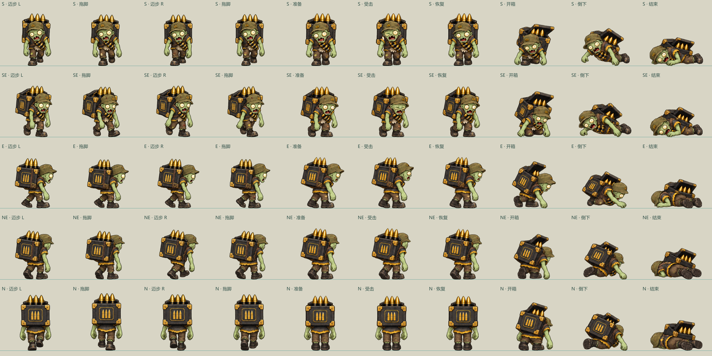
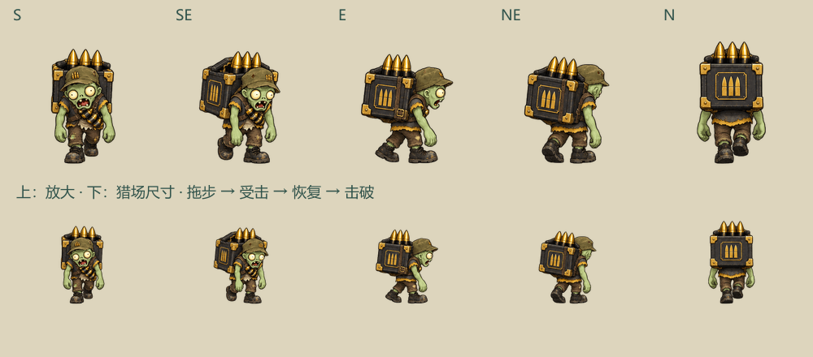

# 黑金背弹僵尸：资源与玩法接入

2026-09-23。新增猎场 kind 12；已接入当前本地工程。图形资源由内置 imagegen 按已确认概念制作。

## 体验

- 在同一倍率下累计消耗 100 枪的库存黑金弹后获得一次资格；×1 / ×5 / ×20 / ×100 分别消耗 100 / 500 / 2000 / 10000 发，击破返还 20 / 100 / 400 / 2000 发。
- 每种倍率独立累计。免费奖励弹和免费武器射击不增加资格。退场后继续保留剩余进度。
- 僵尸有三格箱扣，每次有效射击扣一格。同一发霰弹的所有弹片、同一颗子弹触发的爆炸/散射/电弧连锁共用射击标识，最多扣一格。
- 显示“返弹 +数量”和箱扣进度；击破开箱、倒地，4 个黑金弹图标飞向真实弹药库存栏。库存先结算，飞行只作反馈。
- 生成时将返还数额记录在这只僵尸上；在场时可自由切换倍率，也可使用其他倍率的武器技能。×100 生成后切 ×1 击破仍返 2000，×1 生成后切 ×100 仍返 20。返弹怪不奖励核心。
- 奖励射击、武器技能、运钞挑战或转场进行中时，未出场的资格等待。原有奖励模式和武器技能自身的倍率规则保留，返弹怪不会额外锁定倍率。
- 同时最多一只，缓慢在猎场内绕行，不超时消失。断弹可以暂停获取补给，回来继续；在场时新运钞挑战和转场等待。

## 美术交付

正式图集：[carrier.png](../public/assets/hunt/ammo-carrier-v1/carrier.png)，3200×1600 真透明 PNG。10 列 × 5 行，每格 320×320，共 **50 帧**。行顺序为 S、SE、E、NE、N；SW、W、NW 用对应右向镜像，覆盖八方向。

| 帧列（从 0 开始） | 动作 | 时间与约束 |
|---|---|---|
| 0–3 | 四拍负重拖步 | 0.23 / 0.15 / 0.25 / 0.17 秒，循环；左右脚交换，位移由模拟驱动 |
| 4 | 准备 / 静止 | 双脚落地，身体保持弓背 |
| 4–6 | 准备 → 受击 → 恢复 | 0.02 / 0.065 / 0.045 秒；下半身及低垂手部来自同向准备帧的相同像素 |
| 7–9 | 开箱 → 倒下 → 静止 | 0.16 / 0.20 / 0.75 秒；不循环、不站回；总展示 1.5 秒并渐隐 |

固定脚底锚点 `[160,296]`，展示参考高度 236。每张源图采用一个统一缩放系数，不按每帧身体高度拉伸；倒地保留真实缩短轮廓。受击列 5、6 的 y≥194 区域复制自列 4，连同低垂双手固定，避免横切手指或双靴重影。

- [准备姿势头像](../public/assets/hunt/ammo-carrier-v1/portrait.png)
- [行走原图](art/ammo-carrier-v1/walk-source.png) / [受击与击破原图](art/ammo-carrier-v1/actions-source.png)
- [完整提示词](art/ammo-carrier-v1/prompts.json) / [裁切、统一缩放与锚点记录](art/ammo-carrier-v1/mapping.json)
- [受击半透明叠图](art/ammo-carrier-v1/hit-overlay.png) / [动作清单](art/ammo-carrier-v1/archetype.json)

内置动画预览 `/animation-preview/hunt.html` 已加入黑金背弹僵尸，可切八方向、慢放、暂停、逐帧、受击和击破。实际运行使用独立帧动画；其他四套原型保留已有连续步态。

## 结算与预算

`ammoCarrier.rooms` 保存各倍率实际消耗量和已结算次数；`active` 保存本次序号、资格倍率、固定返还数额 `refundAmount`、已命中的射击标识和移动状态。资格用“累计消耗 / 门槛 − 已结算 − 在场”推导。显示、击破反馈和库存到账使用记录的数额；读档保留玩家选择的倍率，旧版在场僵尸按其资格倍率补齐数额。返弹结算在 `saveHunt` 内与共享库存同时提交，重放同一存档不再加弹；改写返还数额、旧进度回滚或跳过资格的结算会被拒绝。

每次实际消耗一发黑金弹，将 **2.032 核心价值（2032 毫核心）**从原功能事件注资中预留给返弹，功能事件净注资从 5.080 调整为 3.048。100 发对应预留 203.2 核心价值，按现有“普通基准 + 功能事件基准”10.16 核心/发估值覆盖返还的 20 发。独立字段 `ammoReturnFunding` 纳入守恒审计，不混用现有核心事件退款接口。

该预算是按现有声明基准做的返弹预留，守恒检查已通过；它不等于完整长期命中率或所有奖励的实测平衡结论。返还后的弹药再次实际消耗，会按既有规则积累核心、运钞和返弹进度；库存到账本身不产生这些进度。

旧存档从升级后的新消耗开始累计返弹资格，历史消耗不补发。恢复时保留已命中箱扣、在场位置、运行中的冻结状态及射击去重标识。

## 验证

- `node scripts/test-ammo-carrier.mjs`：四档倍率的阈值和固定返还、自由切倍率、跨倍率技能、真实低倍率补刀、同发霰弹/爆炸去重、连续资格、断弹不退场、转场限制、暂停、切倍率后读档续打、重复提交、旧存档迁移和预算守恒；50 帧透明边界、固定区域、八向渲染、冻结和非循环死亡。
- 既有猎场射速、区域解锁、资源循环、多方向、生产资源及步态回归均通过。
- TypeScript 检查通过；项目原生生产构建通过。Sites 构建包装器仍遇到已有 npm shim 路径缺失，使用项目自身的 `vinext build` 成功完成。
- 已检查逐帧图、受击叠图和实际显示尺寸。未做浏览器自动操作或真机验收；当前交付为本地接入，未发布远程版本。

资源可通过 `node scripts/build-ammo-carrier-art.mjs` 从已保存的生成源图复现，不需要重新生图。
